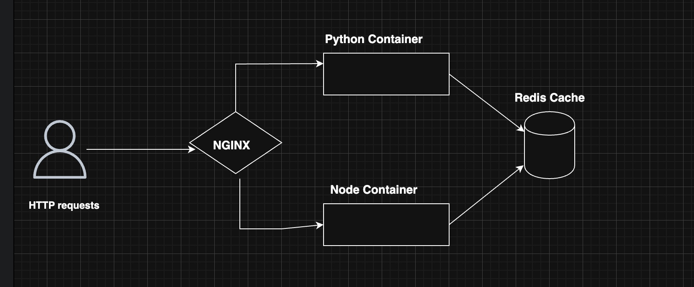

# desafio_devops_2025
## Repositório de códigos do Desafio Devops 2025

## Como usar
##### $ cd scripts 
##### $ ./build-images.sh
##### $ cd ../deploy
##### $ ./init-swarm.sh
##### $ curl http://localhost/app-node/dados
##### $ curl http://localhost/app-node/horario
##### $ curl http://localhost/app-python/dados
##### $ curl http://localhost/app-python/horario

## Melhorias
####    Adicionar observabilidade para identificar erros de respostar do endpoints
####    Adicionar observabilidade para identificar falhas na infra.
####    Adicionar recomendações de segurança nas imagnes
####    Adicionar autenticação na camada de cache
####    Adicionar Multistages build com distroless nas imagens 
####    Alterar deploy para kubernetes

## Diagrama de arquitetura

